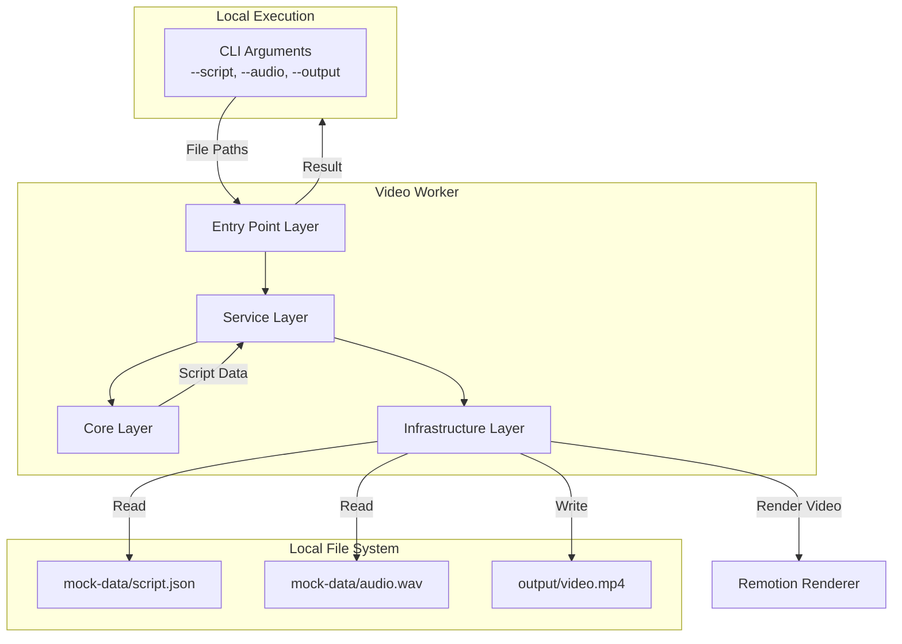
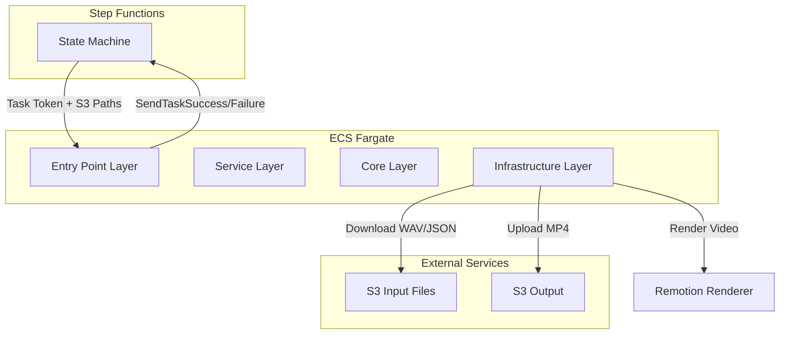
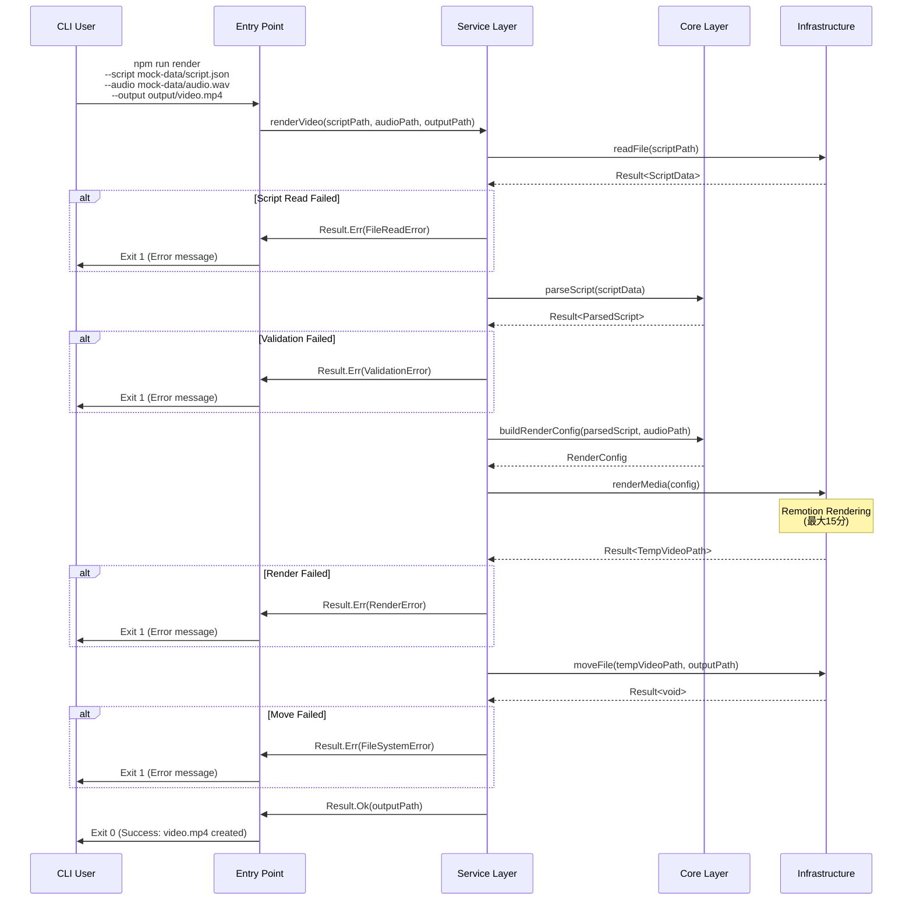
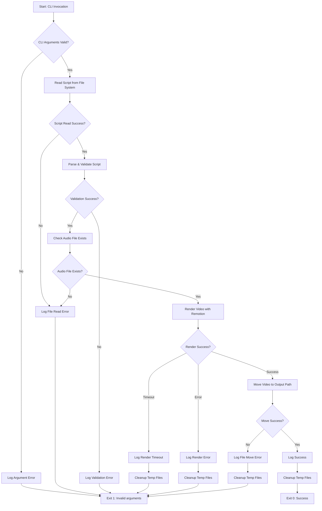

# Video Worker 技術設計書

## Overview

Video Workerは、AI Agentと社会人の対話形式でニュースを深掘りするラジオ動画を生成するサービスです。Remotionを使用して、音声ファイル（WAV）とスクリプト（JSON）を入力として、MP4形式の動画を生成します。

**Purpose**: 音声とスクリプトを同期した対話型ニュース解説動画をプログラマティックに生成する。

**Users**: 将来的にはStep Functionsワークフローから呼び出されるが、Phase 1ではローカル開発とテストを重視する。

**Impact**: 新規機能として、完全な動画生成パイプラインのコア部分を実現する。

### Development Phases

**Phase 1: Remotionコア機能（MVP）** 🎯 **現在のスコープ**
- モックデータ（WAV + JSON）から動画（MP4）を生成
- 対話形式の動画構成（AI Agent + 社会人男性）を実装
- Remotionコンポーネント実装:
  - ニュースリスト表示
  - 概念説明テンプレート（図解 + 箇条書き）
  - 会話サマリー
  - アバター表示（静止画 + モーション効果）
- ローカル実行可能（`npm run render`）
- Railway Oriented Programmingパターンに従ったエラーハンドリング
- **スコープ外**: S3連携、Step Functions統合、Docker化、ECS Fargate

**Phase 2: AWS統合（将来実装）**
- S3からの入力取得とS3への出力アップロード
- Step Functions統合（タスクトークン処理）
- ECS Fargate対応とDocker化
- 本番環境デプロイ

### Goals (Phase 1)

- モックデータ（WAV + JSON）からRemotionで1920x1080 @30fpsの動画を生成
- 対話形式の動画構成を実装（導入→ニュースリスト→深掘り×3→まとめ）
- Railway Oriented Programmingパターンに従った堅牢なエラーハンドリングを実装
- メモリ使用量4GB以内、レンダリング時間15分以内の性能要件を達成
- ローカル開発環境での高速イテレーションをサポート

### Non-Goals (Phase 1)

- S3連携（Phase 2で実装）
- Step Functions統合（Phase 2で実装）
- Docker化とECS Fargate対応（Phase 2で実装）
- リアルタイム動画ストリーミング（バッチ処理のみ）
- 複数動画の並列レンダリング（1タスク=1動画）
- 動画編集UI（プログラマティックレンダリングのみ）

## Architecture

> 詳細な調査ノートは`research.md`に記載。設計の決定事項と契約はすべてここに記載。

### Architecture Pattern & Boundary Map

**Selected Pattern**: Simple Service Layer with Functional Core principles

**Architecture Integration**:
- **パターン選択理由**: 単一責任サービス（動画レンダリング）には完全なHexagonalアーキテクチャは過剰。ただし、テスト容易性のためにコアビジネスロジックを副作用から分離。
- **Domain/Feature Boundaries**:
  - **エントリーポイント層**: CLIエントリーポイント（引数解析、ファイルパス処理）
  - **サービス層**: ワークフロー制御、オーケストレーション、エラー変換
  - **コア層**: 純粋なビジネスロジック（スクリプト解析、検証、レンダリング設定構築）
  - **インフラ層**: 外部依存（Remotion、File System）
- **Existing Patterns Preserved**: プロジェクト全体のRailway Oriented Programmingパターンを継承
- **Steering Compliance**: CLAUDE.mdのコーディング標準に準拠（ROP、TDD、try/catchの回避）

**Phase 1 Architecture** (Current Scope):



**Phase 2 Architecture** (Future):



**Key Decisions**:
- Phase 1: ローカルファイルシステムを直接操作、CLI引数でファイルパスを指定
- Phase 1: エントリーポイントをシンプルなNode.jsスクリプトとして実装
- コア層を純粋関数として実装（副作用なし、テスト容易、Phase 2でも再利用可能）
- インフラ層の依存関係をすべてResult<T, E>でラップ
- Phase 2への移行を容易にするため、サービス層はファイルシステム操作に直接依存しない

### Technology Stack

**Phase 1 (Current Scope)**:

| Layer | Choice / Version | Role in Feature | Notes |
|-------|------------------|-----------------|-------|
| Runtime | Node.js 20 LTS | TypeScript実行環境 | ローカル開発環境 |
| Video Rendering | Remotion 4.0.419 | プログラマティック動画生成 | 既存video-workerパッケージのバージョンを継承 |
| Browser Automation | Chrome Headless Shell | RemotionのReactレンダリング | `npx remotion browser ensure`でインストール |
| Video Encoding | FFmpeg 7.1 (Bundled) | MP4エンコード | Remotion v4にバンドル済み |
| Type System | TypeScript 5.9.3 | 型安全性とエラー処理 | Result<T, E>型でRailway Oriented Programming実装 |
| UI Framework | React 18 | Remotionコンポーネント実装 | Remotionが要求するバージョン |
| Testing | Vitest | ユニット・統合テスト | 高速で軽量なテストランナー |

**Phase 2 (Future)**:

| Layer | Choice / Version | Role in Feature | Notes |
|-------|------------------|-----------------|-------|
| Cloud Storage | AWS SDK v3 (@aws-sdk/client-s3) | S3ファイル操作 | Phase 1のFileSystemClientを置き換え |
| Orchestration | AWS SDK v3 (@aws-sdk/client-sfn) | Step Functionsコールバック | タスクトークン処理 |
| Container | Docker + Debian 12 (bookworm-slim) | ECS Fargateデプロイ | Chrome依存関係を含むマルチステージビルド |

**Rationale Summary**:
- Remotion 4.0.419: 既存プロジェクトのバージョンに合わせて統一。renderMedia() APIでプログラマティックレンダリングをサポート（詳細は`research.md`）。
- Chrome Headless Shell: Chrome for Testingより軽量でCPU依存型レンダリングに最適。
- Vitest: テスト駆動開発に最適な高速テストランナー。Jest互換のAPIで移行が容易。
- Phase 1でファイルシステム操作を抽象化することで、Phase 2でS3Clientに置き換え可能。

## System Flows

### 動画生成フロー (Phase 1)



**Flow-level Decisions**:
- **Early Exit**: 各ステップで失敗時に即座にエラーメッセージを表示してプロセスを終了（Exit Code 1）
- **No Retry**: Phase 1では自動リトライなし（ローカル実行のため、ユーザーが手動で再実行）
- **Progress Logging**: Remotionレンダリング中は`onProgress`コールバックで進行状況をコンソールに出力（例: "Rendering: 30% (450/1500 frames)"）
- **Temp File Management**: Remotionがテンポラリディレクトリにレンダリング後、指定された出力パスに移動
- **Phase 2 Migration**: サービス層のインターフェースを維持することで、Phase 2でファイルシステム操作をS3操作に置き換え可能

### エラーハンドリングフロー (Phase 1)



**Key Decisions**:
- すべてのエラーパスで詳細なエラーメッセージをコンソールに出力
- 一時ファイルクリーンアップをfinally/destructorパターンで保証（成功・失敗に関わらず）
- Exit Code 1で終了（エラー時）、Exit Code 0で終了（成功時）
- エラーメッセージは人間が読みやすい形式で出力（JSON形式ではなくプレーンテキスト）
- Phase 2への移行: エラーハンドリングロジックを変更せず、出力先（コンソール→Step Functions）のみを変更

## Requirements Traceability

| Requirement | Summary | Components | Interfaces | Flows |
|-------------|---------|------------|------------|-------|
| 1.1, 1.2 | S3パス受信 | EntryPoint | StepFunctionsInput | 動画生成フロー |
| 1.3, 1.4 | S3ファイルダウンロード | S3Client | S3Operations | 動画生成フロー |
| 1.5, 1.6 | ダウンロード失敗処理 | S3Client, ErrorHandler | ErrorReporting | エラーハンドリングフロー |
| 1.7 | ファイル整合性検証 | S3Client | S3Operations | 動画生成フロー |
| 2.1, 2.2 | JSONパース | ScriptParser | ScriptParsing | 動画生成フロー |
| 2.3, 2.4, 2.5 | スクリプト情報抽出 | ScriptParser | ScriptParsing | 動画生成フロー |
| 2.6 | バリデーションエラー | ScriptValidator, ErrorHandler | Validation, ErrorReporting | エラーハンドリングフロー |
| 3.1, 3.2, 3.3 | Remotion動画レンダリング | RemotionRenderer | RemotionService | 動画生成フロー |
| 3.4, 3.5, 3.6, 3.7 | 動画設定（解像度、FPS、コーデック） | RenderConfigBuilder | RenderConfig | 動画生成フロー |
| 3.8, 3.9 | レンダリングエラー、進行状況 | RemotionRenderer, Logger | RemotionService, Logging | エラーハンドリングフロー |
| 4.1, 4.2, 4.3 | MP4検証とS3アップロード | S3Client | S3Operations | 動画生成フロー |
| 4.4, 4.5, 4.6 | S3オブジェクトキー、URI返却 | S3Client, EntryPoint | S3Operations, StepFunctionsCallback | 動画生成フロー |
| 4.7, 4.8 | アップロードリトライ | S3Client, ErrorHandler | S3Operations, ErrorReporting | エラーハンドリングフロー |
| 5.1, 5.2, 5.3, 5.4 | 構造化ログ | Logger | Logging | 全フロー |
| 5.5, 5.6, 5.7 | Result型エラーハンドリング | ErrorHandler, Result型 | ErrorReporting | エラーハンドリングフロー |
| 6.1, 6.2, 6.3, 6.4, 6.5 | Dockerコンテナ、環境変数 | Dockerfile, EntryPoint | Container | - |
| 6.6, 6.7, 6.8 | タスクトークン処理 | EntryPoint | StepFunctionsCallback | 動画生成フロー |
| 6.9 | コンテナ起動最適化 | Dockerfile | Container | - |
| 7.1, 7.2, 7.3, 7.4, 7.5 | モックモード | EntryPoint, MockDataLoader | MockMode | - |
| 8.1, 8.2, 8.3 | リソース管理、性能要件 | TempFileManager, RemotionRenderer | ResourceManagement | 全フロー |
| 8.4, 8.5 | メモリ効率、並列処理 | RemotionRenderer | RemotionService | 動画生成フロー |

## Components and Interfaces

### Component Summary

**Phase 1 (Current Scope)**:

| Component | Domain/Layer | Intent | Req Coverage | Key Dependencies (P0/P1) | Contracts |
|-----------|--------------|--------|--------------|--------------------------|-----------|
| EntryPoint | Entry | CLIエントリーポイント、引数解析、実行制御 | 1.1, 1.2, 7.1 | VideoService (P0), Logger (P1) | Service |
| VideoService | Service | 動画生成ワークフローオーケストレーション | 全要件 | FileSystemClient (P0), RemotionRenderer (P0), ScriptParser (P0), RenderConfigBuilder (P0) | Service |
| ScriptParser | Core | スクリプトJSON解析と検証 | 2.1, 2.2, 2.3, 2.4, 2.5, 2.6 | なし（純粋関数） | Service |
| RenderConfigBuilder | Core | Remotionレンダリング設定構築 | 3.4, 3.5, 3.6, 3.7 | なし（純粋関数） | Service |
| RemotionRenderer | Infrastructure | Remotion renderMedia() API呼び出し | 3.1, 3.2, 3.3, 3.8, 3.9, 8.3, 8.4, 8.5 | @remotion/renderer (P0), FFmpeg (P0) | Service |
| FileSystemClient | Infrastructure | ファイル読み込み/書き込み操作 | 1.3, 1.4, 1.5, 1.6, 1.7, 4.1, 4.2, 4.3 | Node.js fs module (P0) | Service |
| ErrorHandler | Service | エラー変換と構造化レポート | 5.5, 5.6, 5.7 | Logger (P1) | Service |
| Logger | Infrastructure | 構造化ログ出力（コンソール） | 5.1, 5.2, 5.3, 5.4 | Console (P0) | Service |
| TempFileManager | Infrastructure | 一時ファイルクリーンアップ | 8.1 | File System (P0) | Service |

**Remotion Components** (React Components for Video Rendering):

| Component | Intent | Props | Visual Features |
|-----------|--------|-------|-----------------|
| NewsListComponent | ニュース一覧表示 | items: NewsItem[] | カード形式、順次アニメーション |
| ConceptExplanationComponent | 概念説明 | data: ConceptExplanationData | テンプレート切り替え（箇条書き/図解/タイムライン） |
| ConversationSummaryComponent | 会話要約 | data: ConversationSummaryData | 箇条書き、重要度別ハイライト |
| AvatarComponent | 発話者アバター | speaker: Speaker, isActive: boolean | 静止画 + モーション効果（拡大/上下動） |
| VideoComposition | メインコンポジション | script: ParsedScript, audioPath: string | 全コンポーネントの統合 |

**Phase 2 Components** (Future):

| Component | Domain/Layer | Intent | Key Dependencies |
|-----------|--------------|--------|------------------|
| S3Client | Infrastructure | S3ダウンロード/アップロード操作 | @aws-sdk/client-s3 (P0) |
| StepFunctionsClient | Infrastructure | SendTaskSuccess/Failure通知 | @aws-sdk/client-sfn (P0) |

### Entry Point Layer

#### EntryPoint

| Field | Detail |
|-------|--------|
| Intent | Step Functions統合のエントリーポイント。タスクトークン処理、環境変数解析、最終結果のコールバック送信を担当 |
| Requirements | 1.1, 1.2, 6.6, 6.7, 6.8, 7.1 |

**Responsibilities & Constraints**
- 環境変数（`TASK_TOKEN`, `S3_SCRIPT_PATH`, `S3_AUDIO_PATH`, `MOCK_MODE`）の読み取りと検証
- VideoServiceの呼び出しとResult<T, E>型のハンドリング
- 成功時にSendTaskSuccessでS3 URIを返却、失敗時にSendTaskFailureでエラー詳細を返却
- モックモードの判定とMockDataLoaderへの委譲
- Exit Code 0での終了を保証（ECSタスクステータスには失敗を記録しない）

**Dependencies**
- Outbound: VideoService — 動画生成ワークフロー実行 (P0)
- Outbound: StepFunctionsClient — タスク完了通知 (P0)
- Outbound: MockDataLoader — モックモード時のデータ提供 (P1)
- External: Step Functions — タスクトークン受信と完了通知 (P0)

**Contracts**: Service [x] / API [ ] / Event [ ] / Batch [x] / State [ ]

##### Service Interface

```typescript
interface EntryPoint {
  main(): Promise<void>;
}

// 環境変数型定義
interface EnvironmentConfig {
  taskToken: string | null;
  s3ScriptPath: string;
  s3AudioPath: string;
  s3OutputBucket: string;
  mockMode: boolean;
  awsRegion: string;
}
```

- **Preconditions**: 環境変数`S3_SCRIPT_PATH`, `S3_AUDIO_PATH`, `S3_OUTPUT_BUCKET`, `AWS_REGION`が設定されていること
- **Postconditions**: VideoService実行後、Step FunctionsにSendTaskSuccess/Failureを送信し、プロセスをExit Code 0で終了
- **Invariants**: `TASK_TOKEN`が存在する場合は必ずStep Functionsコールバックを実行。存在しない場合はローカルモード（ログのみ出力）

##### Batch / Job Contract

- **Trigger**: Step Functionsの`arn:aws:states:::ecs:runTask.waitForTaskToken`によるECSタスク起動
- **Input**: 環境変数`TASK_TOKEN`, `S3_SCRIPT_PATH`, `S3_AUDIO_PATH`, `S3_OUTPUT_BUCKET`, `AWS_REGION`, `MOCK_MODE`（オプション）
- **Output**: Step Functionsへのコールバック（成功: `{ s3Uri: string }`, 失敗: `{ error, cause, context }`）
- **Idempotency & Recovery**: VideoServiceは冪等性を保証しない（S3アップロードは既存ファイルを上書き）。Step Functions側でリトライロジックを実装

**Implementation Notes**
- **Integration**: 環境変数パース失敗時は即座にSendTaskFailureを送信（Step Functionsに通知）
- **Validation**: 環境変数検証にZodスキーマを使用し、型安全性を保証
- **Risks**: `TASK_TOKEN`がnullの場合はローカルモードと見なすが、本番環境では必須。CloudFormationテンプレートで環境変数を強制

### Service Layer

#### VideoService

| Field | Detail |
|-------|--------|
| Intent | 動画生成ワークフロー全体のオーケストレーション。S3ダウンロード、スクリプト解析、レンダリング、S3アップロードを順次実行 |
| Requirements | 全要件（1-8） |

**Responsibilities & Constraints**
- 動画生成ワークフローのステップを順次実行（S3ダウンロード → 解析 → レンダリング → アップロード）
- 各ステップのResult<T, E>を評価し、エラー時に早期リターン
- ログ出力（開始時刻、終了時刻、処理時間、各ステップの成功/失敗）
- 一時ファイル管理（TempFileManagerを使用してクリーンアップ）
- トランザクション境界: なし（各ステップは独立、失敗時は全体を中断）

**Dependencies**
- Outbound: S3Client — S3ファイル操作 (P0)
- Outbound: ScriptParser — スクリプト解析 (P0)
- Outbound: RenderConfigBuilder — レンダリング設定構築 (P0)
- Outbound: RemotionRenderer — 動画レンダリング (P0)
- Outbound: TempFileManager — 一時ファイル管理 (P0)
- Outbound: ErrorHandler — エラー変換 (P1)
- Outbound: Logger — ログ出力 (P1)

**Contracts**: Service [x] / API [ ] / Event [ ] / Batch [ ] / State [ ]

##### Service Interface

```typescript
interface VideoService {
  renderVideo(scriptPath: string, audioPath: string): Promise<Result<string, VideoServiceError>>;
}

interface VideoServiceError {
  type: 'S3_DOWNLOAD_ERROR' | 'VALIDATION_ERROR' | 'RENDER_ERROR' | 'S3_UPLOAD_ERROR';
  message: string;
  cause: Error | null;
  context: Record<string, unknown>;
}
```

- **Preconditions**: `scriptPath`と`audioPath`がS3 URI形式（`s3://bucket/key`）であること
- **Postconditions**: 成功時はS3にアップロードされた動画のURI（`s3://bucket/key`）を返却、失敗時はエラー詳細を含むResult.Errを返却
- **Invariants**: 一時ファイルは処理終了後に必ずクリーンアップ（成功・失敗に関わらず）

**Implementation Notes**
- **Integration**: ScriptParserとRenderConfigBuilderは純粋関数のため、モック不要でテスト容易
- **Validation**: スクリプト検証失敗時はValidationErrorを返却し、詳細な検証エラーメッセージをログ出力
- **Risks**: Remotionレンダリングが15分を超える場合、ECS Fargateタスクタイムアウト（16分）に達する可能性。タイムアウト監視を実装し、事前に検出

#### ErrorHandler

| Field | Detail |
|-------|--------|
| Intent | ドメインエラーをStep Functions用の構造化エラー形式に変換 |
| Requirements | 5.5, 5.6, 5.7 |

**Responsibilities & Constraints**
- Result.Errからエラー詳細を抽出し、`{ error, cause, context }`形式に変換
- エラータイプごとに適切なエラーメッセージを生成
- エラーコンテキストに関連情報（S3パス、フレーム番号など）を含める
- SendTaskFailureペイロード制限（32KB）を考慮してコンテキストを切り詰め

**Dependencies**
- Outbound: Logger — エラーログ出力 (P1)

**Contracts**: Service [x] / API [ ] / Event [ ] / Batch [ ] / State [ ]

##### Service Interface

```typescript
interface ErrorHandler {
  formatError(error: VideoServiceError): StepFunctionsError;
}

interface StepFunctionsError {
  error: string;
  cause: string;
  context: Record<string, unknown>;
}
```

- **Preconditions**: `error`がVideoServiceErrorの定義に従っていること
- **Postconditions**: SendTaskFailureに渡すことができる構造化エラーオブジェクトを返却
- **Invariants**: `context`フィールドのJSONシリアライズ後のサイズが32KB以下であること

**Implementation Notes**
- **Integration**: EntryPointがSendTaskFailure呼び出し前にformatError()を実行
- **Validation**: contextフィールドが32KB制限を超える場合、自動的に切り詰め（先頭100文字のみ保持）
- **Risks**: エラーメッセージに機密情報（S3パス、スクリプト内容）が含まれる可能性。本番環境ではログレベルでフィルタリング

### Core Layer

#### ScriptParser

| Field | Detail |
|-------|--------|
| Intent | スクリプトJSONファイルを解析し、発話者情報、テキスト、タイムスタンプを抽出。バリデーションを実施 |
| Requirements | 2.1, 2.2, 2.3, 2.4, 2.5, 2.6 |

**Responsibilities & Constraints**
- JSON文字列をパースし、スキーマ検証を実施
- 必須フィールド（speakers, segments）の存在確認
- 各セグメントのタイムスタンプ検証（startTime < endTime、重複なし）
- 発話者情報の抽出（id, name, voiceId）
- セグメントのソート（startTimeの昇順）
- 純粋関数（副作用なし、テスト容易）

**Dependencies**
- なし（純粋関数）

**Contracts**: Service [x] / API [ ] / Event [ ] / Batch [ ] / State [ ]

##### Service Interface

```typescript
interface ScriptParser {
  parse(jsonContent: string): Result<ParsedScript, ValidationError>;
}

interface ParsedScript {
  speakers: Speaker[];
  segments: Segment[];
  metadata: ScriptMetadata;
}

interface Speaker {
  id: string;
  name: string;
  voiceId: string;
}

interface Segment {
  speakerId: string;
  text: string;
  startTime: number; // 秒単位
  endTime: number;   // 秒単位
}

interface ScriptMetadata {
  title: string;
  createdAt: string;
  durationSeconds: number;
}

interface ValidationError {
  type: 'JSON_PARSE_ERROR' | 'SCHEMA_VALIDATION_ERROR' | 'TIMESTAMP_ERROR';
  message: string;
  fieldPath?: string;
}
```

- **Preconditions**: `jsonContent`が有効なJSON文字列であること（不正な場合はJSON_PARSE_ERRORを返却）
- **Postconditions**: ParsedScriptオブジェクトを返却。segmentsはstartTimeの昇順にソート済み
- **Invariants**: すべてのセグメントで`startTime < endTime`が保証される。セグメントのタイムスタンプは重複しない

**Implementation Notes**
- **Validation**: Zodスキーマを使用してスクリプト構造を検証。カスタムバリデーションルールでタイムスタンプの整合性をチェック
- **Risks**: 極端に長いスクリプト（セグメント数>10,000）の場合、メモリ使用量が増加。バリデーション時にセグメント数制限（例: 5,000）を設定

#### RenderConfigBuilder

| Field | Detail |
|-------|--------|
| Intent | ParsedScriptと音声ファイルパスからRemotionレンダリング設定を構築 |
| Requirements | 3.4, 3.5, 3.6, 3.7 |

**Responsibilities & Constraints**
- Remotion Compositionパラメータを構築（width: 1920, height: 1080, fps: 30）
- コーデック設定（h264, CRF 23）
- 音声ファイルパスとスクリプトセグメントをinputPropsにマッピング
- タイムアウト設定（900,000ms = 15分）
- 並列フレームレンダリング数の設定（concurrency: 2）
- 純粋関数（副作用なし、テスト容易）

**Dependencies**
- なし（純粋関数）

**Contracts**: Service [x] / API [ ] / Event [ ] / Batch [ ] / State [ ]

##### Service Interface

```typescript
interface RenderConfigBuilder {
  buildConfig(script: ParsedScript, audioPath: string): RenderConfig;
}

interface RenderConfig {
  composition: {
    id: string;
    width: number;
    height: number;
    fps: number;
    durationInFrames: number;
  };
  inputProps: {
    audioPath: string;
    segments: Segment[];
    speakers: Speaker[];
  };
  codec: 'h264';
  crf: number;
  imageFormat: 'jpeg';
  timeoutInMilliseconds: number;
  concurrency: number;
  enableMultiProcessOnLinux: boolean;
}
```

- **Preconditions**: `script.metadata.durationSeconds`が0より大きいこと
- **Postconditions**: Remotion renderMedia()に渡すことができる有効なRenderConfigを返却
- **Invariants**: `durationInFrames = Math.ceil(durationSeconds * fps)`で動画の長さを決定

**Implementation Notes**
- **Integration**: VideoServiceがRenderConfigをRemotionRendererに渡す
- **Validation**: durationInFramesが0の場合はエラー（スクリプトが空）
- **Risks**: 極端に長い動画（60分以上）の場合、durationInFramesが大きくなりレンダリング時間が増加。事前にdurationSecondsをチェックし、警告ログを出力

### Infrastructure Layer

#### RemotionRenderer

| Field | Detail |
|-------|--------|
| Intent | Remotion renderMedia() APIを呼び出して動画をレンダリングし、一時ディレクトリにMP4ファイルを出力 |
| Requirements | 3.1, 3.2, 3.3, 3.8, 3.9, 8.3, 8.4, 8.5 |

**Responsibilities & Constraints**
- `@remotion/renderer`のrenderMedia()を呼び出し
- レンダリング進行状況をonProgressコールバックでログ出力
- タイムアウト（15分）を監視し、超過時はレンダリングをキャンセル
- 一時ディレクトリ（`/tmp/remotion-render-${uuid}`）に動画ファイルを出力
- メモリ使用量を監視し、4GBに近づいた場合は警告ログ出力
- レンダリングエラーをResult.Errでラップして返却

**Dependencies**
- External: @remotion/renderer (v4.0.419) — renderMedia() API (P0)
- External: FFmpeg (Bundled) — 動画エンコード (P0)
- External: Chrome Headless Shell — Reactレンダリング (P0)

研究ノート: Remotion renderMedia() APIの詳細なオプションとエラーハンドリングは`research.md`の「Remotion プログラマティックレンダリング」セクションを参照。

**Contracts**: Service [x] / API [ ] / Event [ ] / Batch [ ] / State [ ]

##### Service Interface

```typescript
interface RemotionRenderer {
  render(config: RenderConfig): Promise<Result<string, RenderError>>;
}

interface RenderError {
  type: 'RENDER_TIMEOUT' | 'RENDER_FAILED' | 'BROWSER_ERROR';
  message: string;
  cause: Error | null;
  frameNumber?: number;
}
```

- **Preconditions**: RenderConfigが有効であること、`/tmp`ディレクトリに書き込み権限があること
- **Postconditions**: 成功時は一時ディレクトリ内のMP4ファイルパスを返却、失敗時はRenderErrorを返却
- **Invariants**: レンダリング中止時は一時ファイルを削除し、リソースをクリーンアップ

**Implementation Notes**
- **Integration**: renderMedia()の`onProgress`コールバックで進行状況を10%ごとにログ出力（例: "Rendering: 30% (450/1500 frames)"）
- **Validation**: renderMedia()開始前にChrome Headless Shellの存在を確認（`npx remotion browser ensure`）
- **Risks**:
  - Chromeプロセスがゾンビ化する可能性。タイムアウト時は強制終了（SIGKILL）を送信
  - メモリ使用量が4GBを超える場合、ECS Fargateタスクが強制終了される。concurrency: 2でメモリ使用量を制限

#### S3Client

| Field | Detail |
|-------|--------|
| Intent | S3からファイルをダウンロードし、S3にファイルをアップロード。リトライロジックを含む |
| Requirements | 1.3, 1.4, 1.5, 1.6, 1.7, 4.1, 4.2, 4.3, 4.4, 4.7, 4.8 |

**Responsibilities & Constraints**
- S3からスクリプトファイル（JSON）と音声ファイル（WAV）をダウンロード
- ダウンロードしたファイルを一時ディレクトリに保存
- ファイル整合性検証（Content-MD5チェック）
- S3に動画ファイル（MP4）をアップロード
- オブジェクトキーに日時情報を含む一意の名前を生成（例: `videos/2026-02-09/12345678-uuid.mp4`）
- AWS SDK組み込みリトライロジック（指数バックオフ、最大3回）を使用
- ストリーミングダウンロード/アップロードでメモリ効率を向上

**Dependencies**
- External: AWS S3 (@aws-sdk/client-s3) — S3操作 (P0)
- External: AWS SDK Retry Strategy — 自動リトライ (P0)

研究ノート: AWS SDK v3のエラーハンドリングと型付き例外の詳細は`research.md`の「AWS SDK v3 S3 操作」セクションを参照。

**Contracts**: Service [x] / API [x] / Event [ ] / Batch [ ] / State [ ]

##### Service Interface

```typescript
interface S3Client {
  download(s3Uri: string, localPath: string): Promise<Result<void, S3DownloadError>>;
  upload(localPath: string, s3Bucket: string, s3Key: string): Promise<Result<string, S3UploadError>>;
  generateOutputKey(prefix: string): string;
}

interface S3DownloadError {
  type: 'S3_NOT_FOUND' | 'S3_ACCESS_DENIED' | 'S3_NETWORK_ERROR';
  message: string;
  s3Uri: string;
  cause: Error | null;
}

interface S3UploadError {
  type: 'S3_UPLOAD_FAILED' | 'S3_NETWORK_ERROR';
  message: string;
  localPath: string;
  s3Uri: string;
  cause: Error | null;
  retryCount: number;
}
```

- **Preconditions**:
  - `download()`: s3UriがS3 URI形式（`s3://bucket/key`）であること、localPathが書き込み可能であること
  - `upload()`: localPathのファイルが存在すること、s3Bucketが有効なS3バケット名であること
- **Postconditions**:
  - `download()`: 成功時はlocalPathにファイルを保存、失敗時はS3DownloadErrorを返却
  - `upload()`: 成功時はアップロード先のS3 URI（`s3://bucket/key`）を返却、失敗時はS3UploadErrorを返却
- **Invariants**: リトライは最大3回まで、指数バックオフ（1秒、2秒、4秒）

##### API Contract

| Method | Operation | Request | Response | Errors |
|--------|-----------|---------|----------|--------|
| GET | GetObject | `{ Bucket, Key }` | Stream (Binary) | 404 (NoSuchKey), 403 (AccessDenied), 500 (InternalError) |
| PUT | PutObject | `{ Bucket, Key, Body: Stream }` | `{ ETag, VersionId }` | 403 (AccessDenied), 500 (InternalError) |
| HEAD | HeadObject | `{ Bucket, Key }` | `{ ContentLength, ContentType, ETag }` | 404 (NoSuchKey), 403 (AccessDenied) |

**Implementation Notes**
- **Integration**:
  - `download()`はHeadObjectでファイル存在確認後、GetObjectでダウンロード
  - `upload()`はPutObjectでアップロード、ETagでアップロード成功を確認
- **Validation**:
  - s3Uri解析にURL APIを使用（例: `new URL(s3Uri)`）
  - Content-MD5チェックでファイル整合性を検証（ETagとローカルファイルのMD5を比較）
- **Risks**:
  - 大きなファイル（>1GB）のダウンロード時にメモリ不足の可能性。ストリーミングダウンロード（`getObject().Body.pipe(fs.createWriteStream())`）を実装
  - アップロード時のネットワークエラーでリトライが3回失敗した場合、Step Functionsにエラーを返却

#### StepFunctionsClient

| Field | Detail |
|-------|--------|
| Intent | Step FunctionsにSendTaskSuccess/SendTaskFailureを送信してタスク完了を通知 |
| Requirements | 6.6, 6.7, 6.8 |

**Responsibilities & Constraints**
- タスクトークンを受け取り、Step Functionsにコールバックを送信
- 成功時はSendTaskSuccessでS3 URIを含む出力を送信
- 失敗時はSendTaskFailureでエラー詳細を送信
- タイムアウト処理（SendTaskSuccessが30秒以内に完了しない場合はログ警告）

**Dependencies**
- External: AWS Step Functions (@aws-sdk/client-sfn) — タスク完了通知 (P0)

研究ノート: Step Functionsのタスクトークンパターンの詳細は`research.md`の「ECS Fargate + Step Functions統合」セクションを参照。

**Contracts**: Service [ ] / API [x] / Event [ ] / Batch [ ] / State [ ]

##### API Contract

| Method | Operation | Request | Response | Errors |
|--------|-----------|---------|----------|--------|
| POST | SendTaskSuccess | `{ taskToken, output: JSON }` | `{}` | 400 (InvalidToken), 500 (InternalError) |
| POST | SendTaskFailure | `{ taskToken, error, cause }` | `{}` | 400 (InvalidToken), 500 (InternalError) |

**Implementation Notes**
- **Integration**: EntryPointがVideoService実行後にSendTaskSuccess/Failureを呼び出し
- **Validation**: taskTokenが空文字列の場合はエラー（ローカルモードではSendTask*を呼び出さない）
- **Risks**: SendTaskSuccessの送信に失敗した場合、Step Functionsはタイムアウト（デフォルト1年）まで待機。タイムアウトを16分に設定して早期検出

#### Logger

| Field | Detail |
|-------|--------|
| Intent | 構造化ログをCloudWatch Logsに出力 |
| Requirements | 5.1, 5.2, 5.3, 5.4 |

**Responsibilities & Constraints**
- JSON形式の構造化ログを出力（タイムスタンプ、ログレベル、メッセージ、コンテキスト）
- ログレベル（DEBUG、INFO、WARN、ERROR）をサポート
- エラーログにスタックトレースを含める
- リクエストIDをすべてのログに含める（トレーサビリティ）

**Dependencies**
- External: CloudWatch Logs — ログ保存 (P0)

**Contracts**: Service [x] / API [ ] / Event [ ] / Batch [ ] / State [ ]

##### Service Interface

```typescript
interface Logger {
  debug(message: string, context?: Record<string, unknown>): void;
  info(message: string, context?: Record<string, unknown>): void;
  warn(message: string, context?: Record<string, unknown>): void;
  error(message: string, error: Error | null, context?: Record<string, unknown>): void;
}
```

- **Preconditions**: なし
- **Postconditions**: 構造化ログをstdoutに出力（ECS FargateがCloudWatch Logsに転送）
- **Invariants**: すべてのログに`timestamp`, `level`, `message`, `requestId`フィールドを含む

**Implementation Notes**
- **Integration**: 軽量ロガー（例: pino）を使用して高速ログ出力
- **Validation**: ログレベルを環境変数`LOG_LEVEL`で制御（デフォルト: INFO）
- **Risks**: 過剰なログ出力（DEBUG）によるCloudWatch Logsコスト増加。本番環境ではINFO以上に設定

#### TempFileManager

| Field | Detail |
|-------|--------|
| Intent | 一時ファイルの作成とクリーンアップを管理 |
| Requirements | 8.1 |

**Responsibilities & Constraints**
- 一時ディレクトリ（`/tmp/video-worker-${uuid}`）を作成
- 処理終了後に一時ディレクトリを削除（成功・失敗に関わらず）
- ディスク容量を監視し、空き容量が1GB未満の場合は警告ログを出力

**Dependencies**
- External: File System (Node.js fs module) — ファイル操作 (P0)

**Contracts**: Service [x] / API [ ] / Event [ ] / Batch [ ] / State [ ]

##### Service Interface

```typescript
interface TempFileManager {
  createTempDir(): Promise<Result<string, FileSystemError>>;
  cleanup(tempDir: string): Promise<Result<void, FileSystemError>>;
}

interface FileSystemError {
  type: 'DISK_FULL' | 'PERMISSION_DENIED' | 'IO_ERROR';
  message: string;
  path: string;
  cause: Error | null;
}
```

- **Preconditions**: `/tmp`ディレクトリに書き込み権限があること
- **Postconditions**:
  - `createTempDir()`: 成功時は一時ディレクトリのパスを返却
  - `cleanup()`: 成功時は一時ディレクトリとその中身を削除
- **Invariants**: cleanup()は複数回呼び出しても安全（冪等性）

**Implementation Notes**
- **Integration**: VideoServiceがワークフロー開始時にcreateTempDir()を呼び出し、終了時にcleanup()を呼び出す（finallyブロック）
- **Validation**: cleanup()でディレクトリが存在しない場合はエラーを返さない（既に削除済みと見なす）
- **Risks**: cleanup()が失敗した場合、一時ファイルが残存してディスク容量を圧迫。ECSタスク再起動時に`/tmp`がクリアされることに依存

#### MockDataLoader

| Field | Detail |
|-------|--------|
| Intent | モックモード時にローカルファイルシステムからサンプルデータを読み込む |
| Requirements | 7.2, 7.3, 7.4, 7.5 |

**Responsibilities & Constraints**
- 環境変数`MOCK_MODE=true`の場合、`/app/mock-data/`からサンプルファイルを読み込む
- サンプルスクリプト（`script.json`）とサンプル音声（`audio.wav`）を提供
- モックデータのスキーマが本番データと同一であることを保証

**Dependencies**
- External: File System (Node.js fs module) — ファイル操作 (P1)

**Contracts**: Service [x] / API [ ] / Event [ ] / Batch [ ] / State [ ]

##### Service Interface

```typescript
interface MockDataLoader {
  loadMockScript(): Promise<Result<string, MockDataError>>;
  loadMockAudio(): Promise<Result<string, MockDataError>>;
}

interface MockDataError {
  type: 'MOCK_FILE_NOT_FOUND' | 'MOCK_FILE_READ_ERROR';
  message: string;
  filePath: string;
  cause: Error | null;
}
```

- **Preconditions**: `/app/mock-data/script.json`と`/app/mock-data/audio.wav`が存在すること
- **Postconditions**: 成功時はファイル内容を返却、失敗時はMockDataErrorを返却
- **Invariants**: モックモードは本番環境では無効化されている（環境変数`MOCK_MODE`が未設定）

**Implementation Notes**
- **Integration**: EntryPointがモックモード判定後、MockDataLoaderを呼び出してS3Clientをバイパス
- **Validation**: モックファイルをリポジトリに含め、Dockerイメージビルド時に`/app/mock-data/`にコピー
- **Risks**: モックデータが本番スキーマと乖離する可能性。CIでモックデータのスキーマ検証を実行

## Video Composition Design

### Dialogue Structure

対話形式の動画構成は以下のフローに従います:

```
導入
  ├─ 男性: 挨拶・今日のニュースを依頼
  └─ Agent: 3つのニュースを提示
      └─ [ニュースリストコンポーネント]

ニュース深掘り (×3)
  ├─ 基本概念の説明
  │   ├─ 男性: 基本的な質問 (e.g. 「解散総選挙って何ですか？」)
  │   ├─ Agent: 概念説明
  │   └─ [概念説明コンポーネント: 図解 + 箇条書き]
  │
  ├─ 深掘り
  │   ├─ 男性: 深掘り質問 (e.g. 「なぜ今このタイミングなのですか？」)
  │   └─ Agent: 詳細回答
  │
  └─ 考察
      └─ Agent: 含蓄のある問いを投げる

締め
  ├─ Agent: 全体のまとめ
  └─ [会話サマリーコンポーネント]
```

### Remotion Components

**1. NewsListComponent**
- **用途**: 3つのニュースを一覧表示
- **データ**: ニュースタイトル、カテゴリ、日付
- **ビジュアル**: カード形式のリスト、アニメーション（順次表示）

**2. ConceptExplanationComponent**
- **用途**: 概念や用語の視覚的説明
- **データ**: タイトル、箇条書き項目、図解情報（オプション）
- **ビジュアル**:
  - テンプレート1: 箇条書き + 強調
  - テンプレート2: フローチャート風の図解
  - テンプレート3: タイムライン表示

**3. ConversationSummaryComponent**
- **用途**: 会話内容の要約
- **データ**: 要約テキスト、キーポイントのリスト
- **ビジュアル**: 箇条書き形式、重要度に応じたハイライト

**4. AvatarComponent**
- **用途**: 発話者の視覚的表現
- **データ**: 発話者ID、発話中フラグ
- **ビジュアル**:
  - Phase 1: 静止画 + 口パク風のシンプルなアニメーション（拡大縮小、透明度変化）
  - Phase 2: より高度なアニメーション（表情変化、リップシンクなど）

### Script JSON Schema

スクリプトJSONは以下の構造に従います:

```typescript
interface ScriptJSON {
  metadata: {
    title: string;                  // 動画タイトル (e.g. "2026年2月9日のニュース")
    createdAt: string;              // ISO 8601タイムスタンプ
    durationSeconds: number;        // 動画の総時間（秒）
  };

  speakers: Speaker[];              // 発話者リスト

  segments: Segment[];              // 時系列順のセグメントリスト
}

interface Speaker {
  id: string;                       // 一意識別子 (e.g. "agent", "man")
  name: string;                     // 表示名 (e.g. "AI Agent", "田中さん")
  role: "agent" | "questioner";     // 役割
  avatarPath: string;               // アバター画像のパス (e.g. "assets/agent.png")
  voiceId?: string;                 // VOICEVOX音声ID（Phase 2で使用）
}

interface Segment {
  id: string;                       // セグメント識別子
  speakerId: string;                // 発話者ID（speakers[].idを参照）
  text: string;                     // セリフテキスト
  startTime: number;                // 開始時刻（秒）
  endTime: number;                  // 終了時刻（秒）

  visualComponent?: VisualComponent; // 表示するコンポーネント（オプション）
}

interface VisualComponent {
  type: "news-list" | "concept-explanation" | "conversation-summary";
  data: NewsListData | ConceptExplanationData | ConversationSummaryData;
}

interface NewsListData {
  items: Array<{
    title: string;
    category: string;               // (e.g. "政治", "経済", "テクノロジー")
    date: string;                   // ISO 8601日付
  }>;
}

interface ConceptExplanationData {
  title: string;                    // 概念のタイトル (e.g. "解散総選挙とは")
  template: "bullet-points" | "flowchart" | "timeline"; // テンプレート種別

  // bullet-points用
  bulletPoints?: Array<{
    text: string;
    emphasis?: "high" | "medium" | "low"; // 強調レベル
  }>;

  // flowchart用
  flowchartNodes?: Array<{
    id: string;
    label: string;
    connections: string[];          // 接続先ノードのID
  }>;

  // timeline用
  timelineEvents?: Array<{
    date: string;
    label: string;
    description?: string;
  }>;
}

interface ConversationSummaryData {
  summaryText: string;              // 要約テキスト
  keyPoints: Array<{
    text: string;
    importance: "high" | "medium" | "low";
  }>;
}
```

**Schema Example**:

```json
{
  "metadata": {
    "title": "2026年2月9日のニュース",
    "createdAt": "2026-02-09T09:00:00Z",
    "durationSeconds": 600
  },
  "speakers": [
    {
      "id": "agent",
      "name": "AI Agent",
      "role": "agent",
      "avatarPath": "assets/agent-avatar.png"
    },
    {
      "id": "man",
      "name": "田中さん",
      "role": "questioner",
      "avatarPath": "assets/man-avatar.png"
    }
  ],
  "segments": [
    {
      "id": "seg-001",
      "speakerId": "man",
      "text": "今日のニュースを教えてください",
      "startTime": 0,
      "endTime": 3
    },
    {
      "id": "seg-002",
      "speakerId": "agent",
      "text": "承知しました。今日は以下の3つのニュースについて取り上げます",
      "startTime": 3,
      "endTime": 7,
      "visualComponent": {
        "type": "news-list",
        "data": {
          "items": [
            {
              "title": "政府が新経済対策を発表",
              "category": "政治",
              "date": "2026-02-09"
            },
            {
              "title": "AI技術の新展開",
              "category": "テクノロジー",
              "date": "2026-02-09"
            },
            {
              "title": "環境問題への新たな取り組み",
              "category": "環境",
              "date": "2026-02-09"
            }
          ]
        }
      }
    },
    {
      "id": "seg-003",
      "speakerId": "man",
      "text": "解散総選挙って何ですか？",
      "startTime": 10,
      "endTime": 13
    },
    {
      "id": "seg-004",
      "speakerId": "agent",
      "text": "解散総選挙とは、内閣総理大臣が衆議院を解散し、新たに総選挙を行うことです",
      "startTime": 13,
      "endTime": 20,
      "visualComponent": {
        "type": "concept-explanation",
        "data": {
          "title": "解散総選挙とは",
          "template": "bullet-points",
          "bulletPoints": [
            {
              "text": "内閣総理大臣が衆議院を解散",
              "emphasis": "high"
            },
            {
              "text": "全議員の議席が失効",
              "emphasis": "medium"
            },
            {
              "text": "40日以内に総選挙を実施",
              "emphasis": "medium"
            }
          ]
        }
      }
    }
  ]
}
```

### Avatar Display Strategy

**Phase 1 Implementation** (静止画 + モーション効果):

- **配置**: 画面下部に2つのアバターを左右に配置
- **アニメーション**:
  - 発話中: アバターを拡大（1.1倍）+ 軽い上下動（2-3px）
  - 非発話中: 通常サイズ + 透明度80%
- **トランジション**: `spring`アニメーションで自然な動き

**Phase 2 Implementation** (将来):
- より高度なアニメーション（表情変化、リップシンク、視線移動など）
- VRMモデルまたはSpine2Dアニメーション

## Data Models

### Domain Model

#### 主要エンティティ

**VideoRenderJob** (Aggregate Root)
- 動画生成ジョブ全体を表すルートエンティティ
- 属性:
  - `jobId`: UUID（一意識別子）
  - `scriptPath`: S3 URI
  - `audioPath`: S3 URI
  - `outputPath`: S3 URI（レンダリング完了後）
  - `status`: 'PENDING' | 'RENDERING' | 'COMPLETED' | 'FAILED'
  - `createdAt`: ISO 8601タイムスタンプ
  - `completedAt`: ISO 8601タイムスタンプ（完了時）
  - `error`: エラー詳細（失敗時）
- ビジネスルール:
  - statusがRENDERINGの場合、outputPathはnull
  - statusがCOMPLETEDの場合、outputPathは必須
  - statusがFAILEDの場合、errorは必須

**ParsedScript** (Entity)
- スクリプトファイルを解析した結果を表すエンティティ
- 属性:
  - `speakers`: 発話者リスト
  - `segments`: セグメントリスト（タイムスタンプ順）
  - `metadata`: スクリプトメタデータ
- ビジネスルール:
  - セグメントはstartTimeの昇順にソートされている
  - すべてのセグメントでstartTime < endTime
  - セグメントのタイムスタンプは重複しない

**Speaker** (Value Object)
- 発話者情報を表す値オブジェクト
- 属性: `id`, `name`, `voiceId`
- 不変性: 作成後は変更不可

**Segment** (Value Object)
- スクリプトの1セグメントを表す値オブジェクト
- 属性: `speakerId`, `text`, `startTime`, `endTime`
- 不変性: 作成後は変更不可

#### Domain Events

本機能では明示的なドメインイベントを発行しない（Step Functionsがイベント駆動型ワークフローを管理）。

#### Business Invariants

- **タイムスタンプの整合性**: すべてのセグメントで`startTime < endTime`が保証される
- **一時ファイルのクリーンアップ**: 処理終了後（成功・失敗に関わらず）、一時ファイルは削除される
- **冪等性の欠如**: 同じ入力で複数回実行した場合、S3に複数の動画ファイルが作成される（S3オブジェクトキーがタイムスタンプを含むため）

### Logical Data Model

#### 構造定義

本機能は永続化層を持たないため、論理データモデルは主にメモリ内のデータ構造とS3オブジェクト構造に焦点を当てる。

**S3オブジェクト構造**

入力ファイル:
- スクリプト: `s3://{bucket}/scripts/{date}/{uuid}.json`
- 音声: `s3://{bucket}/audio/{date}/{uuid}.wav`

出力ファイル:
- 動画: `s3://{bucket}/videos/{date}/{uuid}.mp4`

**属性とタイプ**

ScriptJSON（入力）:
```typescript
{
  metadata: {
    title: string;
    createdAt: string; // ISO 8601
    durationSeconds: number;
  };
  speakers: Array<{
    id: string;
    name: string;
    voiceId: string;
  }>;
  segments: Array<{
    speakerId: string;
    text: string;
    startTime: number; // 秒単位
    endTime: number;   // 秒単位
  }>;
}
```

**参照整合性**

- `segments[].speakerId`は`speakers[].id`を参照する必要がある（外部キー制約に相当）
- スクリプト解析時にバリデーションで整合性をチェック

**時系列的側面**

- S3オブジェクトキーに日時情報を含めることで、時系列でのファイル管理を実現
- CloudWatch Logsにタイムスタンプを含めることで、ジョブの開始/終了時刻をトレース可能

#### 整合性と完全性

**トランザクション境界**

- 本機能はトランザクション境界を持たない（各ステップは独立、失敗時は全体を中断）
- S3アップロードは既存ファイルを上書き（バージョニング未使用）

**カスケードルール**

- 一時ファイルのクリーンアップは、VideoService終了時に必ず実行される（cascading delete相当）

### Data Contracts & Integration

#### API Data Transfer

**Step Functionsからの入力**

環境変数として渡される:
```typescript
{
  TASK_TOKEN: string;
  S3_SCRIPT_PATH: string; // 例: "s3://bucket/scripts/2026-02-09/uuid.json"
  S3_AUDIO_PATH: string;  // 例: "s3://bucket/audio/2026-02-09/uuid.wav"
  S3_OUTPUT_BUCKET: string;
  AWS_REGION: string;
  MOCK_MODE?: string; // "true" or 未設定
}
```

**Step Functionsへの出力**

成功時（SendTaskSuccess）:
```typescript
{
  s3Uri: string; // 例: "s3://bucket/videos/2026-02-09/uuid.mp4"
}
```

失敗時（SendTaskFailure）:
```typescript
{
  error: string;        // エラータイプ（例: "RENDER_ERROR"）
  cause: string;        // エラー原因（例: "Timeout after 15 minutes"）
  context: {
    scriptPath?: string;
    audioPath?: string;
    frameNumber?: number;
    // その他のコンテキスト情報
  }
}
```

**バリデーションルール**

- `S3_SCRIPT_PATH`と`S3_AUDIO_PATH`はS3 URI形式（`s3://bucket/key`）
- `S3_OUTPUT_BUCKET`はS3バケット名のみ（プレフィックスなし）
- `TASK_TOKEN`は空文字列不可（ローカルモードを除く）

**シリアライゼーション形式**

- 環境変数: プレーンテキスト
- SendTaskSuccess/Failureのペイロード: JSON
- S3オブジェクト: JSON（スクリプト）、バイナリ（音声、動画）

#### Cross-Service Data Management

**分散トランザクションパターン**

- 本機能は分散トランザクションを使用しない
- Step Functionsが各ステップ（Script Generator → TTS Worker → Video Worker → Upload）を順次実行
- 各ステップは独立しており、失敗時はStep Functionsがリトライまたは失敗パスを実行

**データ同期戦略**

- 同期: なし（各ステップはS3を介してデータを受け渡し）

**結果整合性の処理**

- S3アップロードは結果整合性（最終的にすべてのリージョンで同一のオブジェクトが見える）
- 同一リージョン内のS3操作は強整合性（PUT直後にGETで取得可能）

## Error Handling

### Error Strategy

Video Workerは**Railway Oriented Programming**パターンに従い、Result<T, E>型を使用してすべてのエラーを明示的に伝播します。try/catchブロックは使用せず、エラーはResult.Errとして返却されます。

**Error Categories and Responses**

**User Errors** (入力エラー):
- **Invalid Input**: 環境変数の欠落または不正な形式 → 詳細なエラーメッセージでSendTaskFailure、処理を即座に中断
- **S3 Not Found**: S3パスが存在しない → S3 URIを含むエラーメッセージでSendTaskFailure、処理を即座に中断
- **Validation Error**: スクリプトスキーマ検証失敗 → フィールドパスとエラー理由を含むエラーメッセージでSendTaskFailure

**System Errors** (インフラエラー):
- **S3 Network Error**: S3ダウンロード/アップロード失敗 → AWS SDK組み込みリトライ（最大3回、指数バックオフ）、リトライ失敗後はSendTaskFailure
- **Render Timeout**: Remotionレンダリングが15分を超える → レンダリングをキャンセル、SendTaskFailureでタイムアウト通知
- **Out of Memory**: メモリ使用量が4GBに達する → 警告ログ出力、ECS Fargateタスクが強制終了される前に処理を中断
- **Disk Full**: 一時ファイル作成時にディスク容量不足 → SendTaskFailureでディスク容量エラーを通知

**Business Logic Errors** (ビジネスロジックエラー):
- **Timestamp Conflict**: スクリプトのタイムスタンプが重複または不正 → 詳細なエラーメッセージでSendTaskFailure、セグメント番号を含む
- **Invalid Speaker Reference**: セグメントのspeakerIdが存在しない → エラーメッセージでSendTaskFailure、speakerIdを含む

### Monitoring

**Error Tracking**

- すべてのエラーはCloudWatch Logsに構造化ログとして記録
- エラーログにはスタックトレース、エラーコンテキスト（S3パス、フレーム番号など）を含む
- CloudWatch Logsメトリクスフィルターを使用してエラー発生率を監視

**Logging Strategy**

- ログレベル: DEBUG（開発）、INFO（本番）、WARN（警告）、ERROR（エラー）
- リクエストID: すべてのログに一意のリクエストIDを含めてトレーサビリティを確保
- ログ保持期間: 90日（CloudWatch Logs設定）

**Health Monitoring**

- ECS Fargateタスクのヘルスチェック: なし（バッチ処理のため）
- Step Functionsの実行状態監視: CloudWatch Metricsで実行成功率、失敗率、平均実行時間を監視
- アラート設定: 失敗率が10%を超えた場合、CloudWatch Alarmsで通知

## Testing Strategy

### Unit Tests

1. **ScriptParser.parse()**: 有効/無効なJSONスキーマ、タイムスタンプ検証、speakerIdの参照整合性
2. **RenderConfigBuilder.buildConfig()**: 正しいRemotion設定の生成、durationInFramesの計算
3. **Result型ユーティリティ**: ok(), err(), map(), flatMap(), match()の動作検証
4. **ErrorHandler.formatError()**: 各エラータイプの正しい変換、contextフィールドのサイズ制限
5. **S3Client.generateOutputKey()**: 一意のオブジェクトキー生成、日時情報の正しい形式

### Integration Tests

1. **VideoService.renderVideo()**: モックS3ClientとRemotionRendererを使用した全体ワークフローのテスト
2. **S3Client.download() + upload()**: LocalStackを使用したS3操作のエンドツーエンドテスト
3. **EntryPoint.main()**: モックStep FunctionsClientを使用したSendTaskSuccess/Failureの呼び出し検証
4. **TempFileManager.cleanup()**: 一時ファイルが正しくクリーンアップされることを検証
5. **MockDataLoader**: モックデータのロードとスキーマ検証

### E2E Tests

1. **完全な動画生成フロー**: LocalStackとDockerコンテナを使用したエンドツーエンドテスト（S3ダウンロード → レンダリング → S3アップロード）
2. **エラーハンドリング**: 各エラーシナリオ（S3エラー、バリデーションエラー、レンダリングタイムアウト）のエンドツーエンドテスト
3. **モックモード**: MOCK_MODE=trueでのローカル実行テスト

### Performance Tests

1. **メモリ使用量**: 動画レンダリング中のメモリ使用量が4GB以内であることを検証
2. **レンダリング時間**: 標準的なスクリプト（10分の動画）のレンダリング時間が15分以内であることを検証
3. **並列フレームレンダリング**: concurrency: 2での性能測定、最適な並列数の決定
4. **S3アップロード速度**: 大きな動画ファイル（1GB）のアップロード時間測定

## Security Considerations

### Threat Modeling

**脅威1: S3パスインジェクション**
- シナリオ: 悪意のあるユーザーがS3_SCRIPT_PATH環境変数に不正なS3パスを注入
- 対策: S3 URI形式のバリデーション（正規表現チェック）、S3バケットのIAMポリシーで許可されたバケットのみアクセス可能に制限

**脅威2: スクリプトインジェクション**
- シナリオ: スクリプトJSONに悪意のあるコード（例: XSS）が含まれる
- 対策: スクリプトの内容はReactコンポーネント内でエスケープされる（Remotionのデフォルト動作）。追加のサニタイゼーションは不要

**脅威3: Dockerコンテナのエスケープ**
- シナリオ: 攻撃者がECS Fargateコンテナから脱出してホストにアクセス
- 対策: 非rootユーザーでコンテナを実行、読み取り専用ファイルシステム（一時ディレクトリを除く）、最小限の権限でIAMロールを設定

**脅威4: タスクトークンの漏洩**
- シナリオ: タスクトークンがログに記録され、第三者が不正にSendTaskSuccessを呼び出す
- 対策: タスクトークンをログに記録しない、CloudWatch LogsのIAMポリシーで読み取りアクセスを制限

### Security Controls

**Authentication and Authorization**
- IAMロールベースの認証: ECS FargateタスクにアタッチされたIAMロールでS3とStep Functionsにアクセス
- S3バケットポリシー: 特定のIAMロールのみがスクリプト/音声ファイルのダウンロードと動画ファイルのアップロードを許可
- Step Functionsの実行ロール: Video WorkerからのSendTaskSuccess/Failureのみを許可

**Data Protection**
- S3暗号化: S3オブジェクトはサーバーサイド暗号化（SSE-S3）を使用
- 通信の暗号化: S3とStep FunctionsへのAPIコールはTLS 1.2以上を使用
- ログのマスキング: タスクトークン、S3パスの一部（バケット名のみ記録、キーはハッシュ化）をログから除外

### Compliance Requirements

本機能は特定のコンプライアンス要件（GDPR、HIPAAなど）を想定していないが、以下の一般的なセキュリティベストプラクティスに従う:
- 最小権限の原則: IAMロールに必要最小限の権限のみを付与
- ログ保持期間: 90日（監査要件に応じて延長可能）
- 脆弱性スキャン: Dockerイメージを定期的にスキャン（例: Trivy、AWS ECR Image Scanning）

## Performance & Scalability

### Target Metrics

| Metric | Target | Measurement |
|--------|--------|-------------|
| レンダリング時間 | 15分以内（10分の動画） | CloudWatch Logs（開始〜完了時刻） |
| メモリ使用量 | 4GB以内 | ECS Fargateタスクメトリクス |
| 動画ファイルサイズ | 100MB以下（10分の動画） | S3オブジェクトサイズ |
| S3アップロード時間 | 1分以内（100MBファイル） | CloudWatch Logs |
| エラー率 | 5%以下 | Step Functions実行履歴 |

### Scaling Approaches

**Horizontal Scaling**
- ECS Fargateタスクは並列実行可能（Step Functionsが複数のビデオジョブを同時に起動）
- 制限: なし（ECS Fargateのサービスクォータに依存）

**Vertical Scaling**
- メモリ: 4GB（デフォルト）→ 8GB（長い動画またはメモリ不足の場合）
- CPU: 2 vCPU（デフォルト）→ 4 vCPU（レンダリング時間短縮のため）

**Resource Allocation**
- ECS Fargateタスク定義:
  - CPU: 2048（2 vCPU）
  - Memory: 4096（4 GB）
  - Ephemeral Storage: 20GB（一時ファイル用）

### Caching Strategies

**Chrome Headless Shell Cache**
- Chrome Headless ShellのバイナリをDockerイメージに含めることで、起動時のダウンロードを回避
- イメージビルド時に`npx remotion browser ensure`を実行

**FFmpeg Cache**
- Remotion v4にバンドルされたFFmpegを使用（追加ダウンロード不要）

**S3 Transfer Acceleration**
- 現時点では未使用（将来的に大きなファイルのアップロード時間を短縮する場合に検討）

### Optimization Techniques

**Remotionレンダリング最適化**
- `concurrency: 2`: 並列フレームレンダリング数を制限してメモリ使用量を抑制
- `imageFormat: 'jpeg'`: PNGよりメモリ効率が高い
- `enableMultiProcessOnLinux: true`: マルチコアCPUを活用

**S3操作最適化**
- ストリーミングダウンロード/アップロード: メモリ使用量を削減
- マルチパートアップロード: 大きなファイル（>100MB）の場合、AWS SDKが自動的にマルチパートアップロードを使用

**Docker最適化**
- マルチステージビルド: ビルドツールを本番イメージから除外してイメージサイズを削減
- .dockerignoreの使用: node_modules、テストファイルをイメージに含めない

## Migration Strategy

本機能は新規開発のため、マイグレーション戦略は不要です。ただし、将来的な拡張を考慮した設計ポイント:

### Extensibility

- **テンプレートの追加**: 現在は固定のRemotionコンポジションを使用していますが、将来的に複数のテンプレートをサポートする場合、`TEMPLATE_ID`環境変数を追加してテンプレートを切り替え可能にする
- **動画形式の追加**: 現在はMP4のみサポートしていますが、将来的にWebMやGIFをサポートする場合、`OUTPUT_FORMAT`環境変数を追加してコーデックを選択可能にする
- **クラウドプロバイダーの追加**: 現在はAWS専用ですが、将来的にGCPやAzureをサポートする場合、S3ClientとStep FunctionsClientを抽象化してプロバイダー固有の実装を交換可能にする

### Rollback Strategy

本機能は新規開発のため、ロールバック戦略は不要です。ただし、デプロイメント戦略として以下を推奨:

- **Blue/Green Deployment**: ECS Fargateタスク定義のバージョン管理により、問題発生時に前バージョンに即座にロールバック可能
- **Canary Deployment**: 新バージョンを一部のジョブにのみ適用し、問題がなければ全体に展開

## Supporting References

### Remotion Composition Definition

既存のRemotionコンポジション（`packages/video-worker/src/Root.tsx`）をベースに、スクリプトと音声を同期した動画を生成するコンポジションを新規作成します。

```typescript
// 新規コンポジション: RadioVideo
interface RadioVideoProps {
  audioPath: string;
  segments: Segment[];
  speakers: Speaker[];
}

export const RadioVideo: React.FC<RadioVideoProps> = ({ audioPath, segments, speakers }) => {
  // 実装詳細は design.md の範囲外（実装フェーズで決定）
};
```

### Docker Multi-Stage Build Example

```dockerfile
# Stage 1: Build
FROM node:20-bookworm-slim AS builder
WORKDIR /app
COPY package.json pnpm-lock.yaml ./
RUN corepack enable && pnpm install --frozen-lockfile
COPY . .
RUN pnpm build

# Stage 2: Production
FROM node:20-bookworm-slim
WORKDIR /app

# Chrome dependencies
RUN apt-get update && apt-get install -y \
    libnss3 libdbus-1-3 libatk1.0-0 libgbm-dev libasound2 \
    && rm -rf /var/lib/apt/lists/*

# Chrome Headless Shell
RUN npx remotion browser ensure

# Copy app
COPY --from=builder /app/dist ./dist
COPY --from=builder /app/node_modules ./node_modules
COPY --from=builder /app/package.json ./

# Mock data
COPY mock-data /app/mock-data

# Non-root user
RUN useradd -m -u 1001 videoworker
USER videoworker

CMD ["node", "dist/index.js"]
```

### Environment Variables Reference

| Variable | Required | Default | Description |
|----------|----------|---------|-------------|
| TASK_TOKEN | Yes（本番） | null | Step Functionsタスクトークン |
| S3_SCRIPT_PATH | Yes | - | スクリプトファイルのS3 URI |
| S3_AUDIO_PATH | Yes | - | 音声ファイルのS3 URI |
| S3_OUTPUT_BUCKET | Yes | - | 動画出力先のS3バケット名 |
| AWS_REGION | Yes | - | AWSリージョン（例: ap-northeast-1） |
| MOCK_MODE | No | false | モックモードの有効化（true/false） |
| LOG_LEVEL | No | INFO | ログレベル（DEBUG/INFO/WARN/ERROR） |
| RENDER_TIMEOUT_MS | No | 900000 | レンダリングタイムアウト（ミリ秒） |
| RENDER_CONCURRENCY | No | 2 | 並列フレームレンダリング数 |
